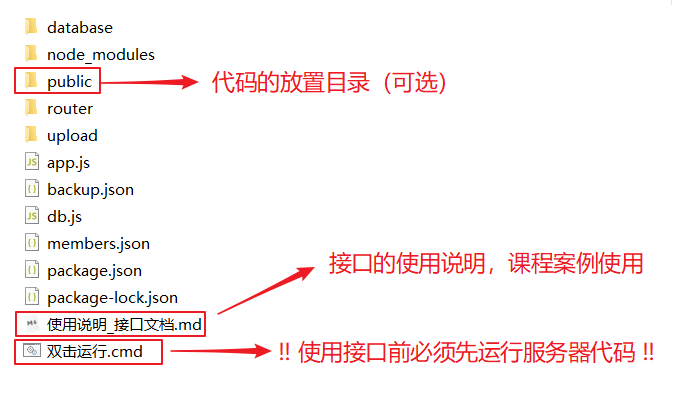
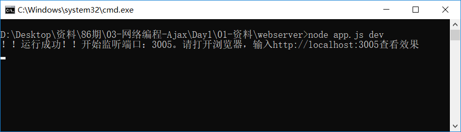

# 接口简介

## 基本介绍

为了方便同学们学习ajax，我们把通过后端代码（nodejs+express）写的一个简单的web服务器打包下发给同学们使用。如下是其文件目录结构，请务必保证`目录结构的正确性`



## 使用方法

### 启动程序

双击可执行文件即可启动 。 如遇到防火墙提示，请选择允许。

如果你看到类似下面的界面，表示启动成功了。



请注意：

- 上面的端口号：**3005**。这个会在后面的操作中使用到。
- **关闭黑窗口等于关闭了服务器**，使用后面的功能时**必须确保黑窗口打开且成功运行**。


### 访问静态文件

1. `把文件放在public下`

   把你写好的html文件，或者是文件夹 放在`public`目录下。假如你的文件名是`test.html`

2. 在浏览器中访问。

   打开浏览器，输入例如`localhost:3005/test.html`就可以访问你的网页内容了。

   注意：

   - 如果在public目录下有一个文件名是index.html，则你可以简写`localhost:3005`来访问它。
   - 可以把localhost改成你自己电脑的ip地址。在window系统中可以通过ipconfig来查看ip地址。

     - 或者通过飞秋查看


### 访问数据接口

#### get类型

对于类型是 get的接口，你可以：

1. 直接在浏览器输入接口的url来访问，以getCurrentTime为例：
2. 也可以通过ajax请求来获取数据。
3. 通过postman访问


#### post类型

对于类型是 post的接口，可以通过ajax请求来获取数据，或者使用postman来访问，但**无法直接在浏览器地址栏中输入地址来访问**。


## 让其它同学来访问你的网页

1. 启动本软件，并确保在浏览器中通过`localhost:3005/网页名.html`可以正常访问网页。
2. 找出本机ip地址：
   1. window系统：在命令行中输入： `ipconfig`
   2. mac系统：在命令行中输入：`ifconfig`
   3. 或飞秋查看（见演示）

3. 在浏览器地址栏中，用你自己的ip地址代替`localhost`,检查是否能够访问。

   例如：`192.168.0.2:3005/网页名.html`

4. 把这个带着ip地址的路径发给你同一个局域网中的同学，让他们通过浏览器来访问。
5. 如果访问不到，试着先关闭你自己电脑的防火墙。

   1. 如何关掉防火墙（见演示）


# 接口列表

> 通过代码请求某个接口，需要注意接口地址的格式：
>
> - 格式1： <http://IP地址:3005/具体接口地址>		--- 访问其他人计算机时使用
> - 格式2：<http://localhost:3005/具体接口地址>     --- 自己写代码时推荐使用
> - 格式3：<http://127.0.0.1:3005/具体接口地址>
>   - 此方式与格式2相同，localhost可理解为127.0.0.1的简写形式。


##  common 普通接口

### 时间戳接口 getCurrentTime

> 功能：获取服务器上的时间戳。

- 接口地址: http://localhost:3005/common/getCurrentTime
- 请求方式:  get
- 返回类型：json
- 请求参数：无
- 返回参数说明：

| 名称        | 类型   | 说明                               |
| ----------- | ------ | ---------------------------------- |
| code        | number | 操作状态，200代表成功，404代表失败 |
| msg         | string | 状态描述信息                       |
| currentTime | string | 时间戳                             |

> 备注：时间戳是指格林威治时间1970年01月01日00时00分00秒(北京时间1970年01月01日08时00分00秒)起至现在的总秒数。

- 返回示例：

```json
{
  "code": 200,
  "msg": "服务器返回成功",
  "currentTime": "1569393188557"
}
```


>\* 附:  以下函数可以把时间戳转成`yyyy-mm-dd hh:mm:ss`格式的时间，可直接使用。

```javascript
function dateFormat(timestamp) {
    var time = new Date(parseInt(timestamp));
    var y = time.getFullYear();
    var m = time.getMonth() + 1;
    m = m > 9 ? m : '0' + m;
    var d = time.getDate();
    d = d > 9 ? d : '0' + d;
    var h = time.getHours();
    h = h > 9 ? h : '0' + h;
    var mm = time.getMinutes();
    mm = mm > 9 ? mm : '0' + mm;
    var s = time.getSeconds();
    s = s > 9 ? s : '0' + s;
    return y + '-' + m + '-' + d + ' ' + h + ':' + mm + ':' + s;
}
```


### get传参示例接口

> 功能：返回请求时传入的请求参数，额外补上服务器端的时间戳和文本信息

- 接口地址:  http://localhost:3005/common/get

- 请求方式:  get
- 返回类型：json

- 请求参数：

| 名称     | 类型   | 说明   |
| -------- | ------ | ------ |
| username | string | 用户名 |

- 返回参数说明：

| 名称     | 类型   | 说明                               |
| -------- | ------ | ---------------------------------- |
| code     | number | 操作状态，200代表成功，404代表失败 |
| msg      | string | 状态描述信息                       |
| username | string | 用户提交的用户名                   |
| _t       | number | 时间戳                             |

- 返回示例：

```json
{
  "code": 200,
  "msg": "服务器返回成功",
  "username": "admin",
  "_t": 1569390629243
}
```


### post传参示例接口

> 功能：返回请求时传入的请求参数，额外补上服务器端的时间戳和文本信息

- 接口地址:  http://localhost:3005/common/post
- 请求方式：post
- 返回类型：json
- 请求参数：

| 名称     | 类型   | 说明   |
| -------- | ------ | ------ |
| username | string | 用户名 |

- 返回参数说明：

| 名称     | 类型   | 说明                               |
| -------- | ------ | ---------------------------------- |
| code     | number | 操作状态，200代表成功，404代表失败 |
| msg      | string | 状态描述信息                       |
| username | string | 用户提交的用户名                   |
| _t       | number | 时间戳                             |

- 返回示例：

```json
{
  "code": 200,
  "msg": "服务器返回成功",
  "username": "admin",
  "_t": 1569390629243
}
```


### 用户名检测 checkUser

> 功能：检查指定的名字是否被占用。目前有三个名字被占用了： 张三，李四，王五

- 接口地址:  http://localhost:3005/common/checkUser
- 请求方式:  post
- 返回类型：json
- 请求参数：

| 名称     | 类型   | 说明   |
| -------- | ------ | ------ |
| username | string | 用户名 |

- 请求示例：` http://localhost:3005/common/checkUser?userName=王阳明`

- 返回参数说明：

| 名称 | 类型   | 说明                               |
| ---- | ------ | ---------------------------------- |
| code | number | 操作状态，200代表成功，404代表失败 |
| msg  | string | 状态描述信息                       |

返回示例：

```json
// 通过示例：
{
  "code": 200,
  "msg": "用户名可以使用"
}
// 失败示例：
{
  "code": 404,
  "msg": "用户名已被占用",
}
```


### 登录检测 login

> 功能：验证登录使用的用户名与密码是否正确
>
> *注：有效信息是：用户名：admin 密码：123456

- 接口地址：http://localhost:3005/common/login
- 请求方式：post
- 返回类型：json
- 请求参数：username：用户名，password：密码

| 名称     | 类型   | 说明   |
| -------- | ------ | ------ |
| username | string | 用户名 |
| password | string | 密码   |

- 返回参数说明：

| 名称 | 类型   | 说明                               |
| ---- | ------ | ---------------------------------- |
| code | number | 操作状态，200代表成功，404代表失败 |
| msg  | string | 状态描述信息                       |

返回示例：

```json
// 通过示例：
{
  "code": 200,
  "msg": "用户名和密码正确，可以登录！~"
}
// 失败示例1：
{
  "code": 404,
  "msg": "用户名或密码错误，我不会告诉你是密码错了~",
}
// 失败示例2：
{
  "code": 404,
  "msg": "用户名或密码错误，我不会告诉你是用户名不存在~",
}
```


### 获取书籍信息 getBookMsgXML

> 功能：获取四大名著的XML格式

- 接口地址：http://localhost:3005/common/getBookMsgXML

- 请求方式：get

- 返回类型：xml

- 请求参数：无

- 返回示例：

```xml
<?xml version="1.0" encoding="utf-8" ?>
<booklist>
<book>
	<author>吴承恩</author>
	<name>西游记</name>
</book>
<book>
	<author>施耐庵</author>
	<name>水浒传</name>
</book>
<book>
	<author>罗贯中</author>
	<name>三国演义</name>
</book>
<book>
	<author>曹雪芹</author>
	<name>红楼梦</name>
</book>
</booklist>
```


### 获取书籍信息 getBookMsgJSON

> 功能：获取四大名著的JSON格式

- 接口地址：http://localhost:3005/common/getBookMsgJSON

- 请求方式：get
- 返回类型：json

- 请求参数：无
- 返回参数说明：

| 名称   | 说明   |
| ------ | ------ |
| author | 作者名 |
| title  | 书名   |

- 返回示例：

```json
[
    { "author": "吴承恩", "title": "西游记" },
    { "author": "施耐庵", "title": "水浒传" },
    { "author": "罗贯中", "title": "三国演义" },
    { "author": "曹雪芹", "title": "红楼梦" }
]
```


### 模拟长时间响应

> 功能：模拟服务器长时间响应。默认5秒之后返回。

- 接口地址：http://localhost:3005/common/sleep

- 请求方式：get
- 返回类型：json

请求参数：

| 名称      | 类型   | 是否必选 | 说明                          |
| --------- | ------ | -------- | ----------------------------- |
| sleepTime | number | 可选     | 服务端响应等待的秒数，默认为5 |

返回示例：

```json
{
  "code": 200,
	"data": "为天地立心，为生民立命，为往圣继绝学，为万世开太平",
	"msg": "服务器忙, 等待了5秒后返回数据"
}
```


### 获取大量模拟数据 bigData

> 功能：模拟获取大数据，仅用来演示readyState状态34的区别

- 接口地址：http://localhost:3005/common/bigData

- 请求方式：get
- 返回类型：string

- 请求参数：无

- 返回示例：略，内容为大量随机字符串。


## 整合的第三方接口 web

> 这个部分的接口取自网络公开的api，它们是否能够正常工作取决于：
>
> 1. 本地电脑能正常联网
> 2. 网络上公开的api能正常工作

### 获取新闻列表 getNews

> 功能：调用知乎提供的接口，获取知乎上的最新的新闻列表

- 接口地址：http://localhost:3005/web/getNews

- 请求方式：get
- 返回类型：json

- 请求参数：无

- 返回示例：

```json
{
  "date": "20190822",
	"stories": 
  	[
      {
        "ga_prefix": "092609",
        "hint": "星球研究所 · 8 分钟阅读",
        "id": 9715495,
        "image_hue": "0x748456",
        "images": ["https://pic3.zhimg.com/v2-e2559d780e633244bf5b2.jpg"],
        "title": "新中国自成立以来有哪些翻天覆地的变化？",
        "type": 0,
        "url": "https://daily.zhihu.com/story/9715495"
      }
		],
	top_stories: 
    [	
      {
      	"ga_prefix": "092009",
        "hint": "作者 / 王瑞恩",
        "id": 9715352,
        "image": "https://pic2.zhimg.com/v2-cb0b7a90fd33f370fc694d554868cda9.jpg",
        "image_hue": "0x1d1d1a",
        "title": "《杀人回忆》故事原型真凶疑似被发现，会对案件发展有什么影响？",
        "type": 0,
        "url": "https://daily.zhihu.com/story/9715352"
      }
    ]
};
```


### 获取新闻详情 getDetailNew

> 功能：获取知乎上某条新闻的详细信息

- 接口地址：http://localhost:3005/web/getDetailNew

- 请求方式：get
- 返回类型：json

- 请求参数：

| 名称 | 类型   | 说明                                                |
| ---- | ------ | --------------------------------------------------- |
| id   | number | 新闻的id，（需要结合上一个接口得到id，例如9715495） |

- 返回参数说明：（仅标出需要使用的部分）

| 名称 | 类型               | 说明                         |
| ---- | ------------------ | ---------------------------- |
| body | string (DOMString) | 某条新闻页面的结构字符串     |
| css  | array              | 某条新闻页面的外链样式表地址 |

- 返回示例：

```json
{
  "body": '<div class="main-wrap content-wrap">↵<div class="h"...',
  "css": ["http://news-at.zhihu.com/css/news_qa.auto.css?v=4b3e3"],
  "ga_prefix": "092609",
  "id": 9715495,
  "image": "https://pic4.zhimg.com/v2-b6a0b1da8de65da4320c6f5b2112aad7.jpg",
  "image_hue": "0x748456",
  "image_source": "星球研究所 / 知乎",
  "images": ["https://pic3.zhimg.com/v2-e2559d780e633244bf5b2e84f244e83e.jpg"],
  "js": [],
  "share_url": "http://daily.zhihu.com/story/9715495",
  "title": "新中国自成立以来有哪些翻天覆地的变化？",
  "type": 0,
  "url": "https://daily.zhihu.com/story/9715495"
}
```


### 获取天气预报 getWeather

接口地址:  http://localhost:3005/web/getWeather

功能：获取天气预报

类型:  get

请求参数：city：String。表示城市名，如果不写，默认是北京。

示例：

​	<http://localhost:3005/web/getWeather?city=武汉>

返回值： json数组


### apiopen提供的接口 getApiOpenNews

> 功能：获取openApi提供的最新的新闻

- 接口地址：http://localhost:3005/web/getWeather/web/getApiOpenNews

- 请求方式：get

- 请求参数：无

- 返回示例：略，见演示。


##  文件相关接口 formData

### 文件上传 upload

- 接口地址:  http://localhost:3005/formData/upload

- 类型:  post

- 请求参数：

| 名称 | 类型     | 说明         |
| ---- | -------- | ------------ |
| file | FormData | 要上传的文件 |

- 返回数据： 无

注意：上传的文件保存在服务端目录`webserver/upload`下


##  留言板案例接口 Message

### 获取留言 getMsg

- 接口地址：http://localhost:3005/message/getMsg

- 请求方式：get
- 返回类型：json

- 请求参数：无
- 返回参数说明：

| 名称    | 类型   | 说明               |
| ------- | ------ | ------------------ |
| name    | string | 发表留言用户的名称 |
| content | string | 留言内容           |
| created | number | 发表时间的时间戳   |

- 返回示例：

```json
[
  {
    "name": "nickname", 
    "content": "这是一条示例留言内容", 
    "created": 1558318250428
  },
  {"name": "jack", "content": "rose在哪", "created": 1563785672986},
  {"name": "rose", "content": "我在这哦", "created": 1563788513790},
  {"name": "oldWang", "content": "嘿嘿", "created": 1563788528244}
]
```


### 新增留言 addMsg

- 接口地址：http://localhost:3005/message/addMsg

- 请求方式：post
- 响应类型：json

- 请求参数：

| 名称    | 类型   | 说明     |
| ------- | ------ | -------- |
| name    | string | 用户名   |
| content | string | 留言内容 |

- 返回参数说明：

| 名称 | 类型   | 说明                               |
| ---- | ------ | ---------------------------------- |
| code | number | 操作状态，200代表成功，404代表失败 |
| msg  | string | 状态描述信息                       |

- 返回示例：

```json
// 成功示例：
{"code": 200, "msg": "添加成功！"}

// 失败示例：
{"code": 404, "msg": "添加失败！"}
```


### 删除留言 delMsg

- 接口地址：http://localhost:3005/message/delMsg

- 请求方式：post
- 响应类型：json

- 请求参数：

| 名称      | 类型   | 说明             |
| --------- | ------ | ---------------- |
| timestamp | string | 发表时间的时间戳 |

- 返回参数说明：

| 名称 | 类型   | 说明                               |
| ---- | ------ | ---------------------------------- |
| code | number | 操作状态，200代表成功，404代表失败 |
| msg  | string | 状态描述信息                       |

- 返回示例：

```json
// 成功示例：
{"code": 200, "msg": "添加成功！"}

// 失败示例：
{"code": 404, "msg": "添加失败！"}
```

## 会员管理案例接口 member

### 获取会员信息 list

- 接口地址：http://localhost:3005/message/getMsg
- 请求方式：get
- 返回类型：json
- 请求参数：无
- 返回参数说明：

| 名称    | 类型   | 说明               |
| ------- | ------ | ------------------ |
| name    | string | 发表留言用户的名称 |
| content | string | 留言内容           |
| created | number | 发表时间的时间戳   |

- 返回示例：

```json
[
  {
    "name": "nickname", 
    "content": "这是一条示例留言内容", 
    "created": 1558318250428
  },
  {"name": "jack", "content": "rose在哪", "created": 1563785672986},
  {"name": "rose", "content": "我在这哦", "created": 1563788513790},
  {"name": "oldWang", "content": "嘿嘿", "created": 1563788528244}
]
```


### 新增留言 addMsg

- 接口地址：http://localhost:3005/message/addMsg
- 请求方式：post
- 响应类型：json
- 请求参数：

| 名称    | 类型   | 说明     |
| ------- | ------ | -------- |
| name    | string | 用户名   |
| content | string | 留言内容 |

- 返回参数说明：

| 名称 | 类型   | 说明                               |
| ---- | ------ | ---------------------------------- |
| code | number | 操作状态，200代表成功，404代表失败 |
| msg  | string | 状态描述信息                       |

- 返回示例：

```json
// 成功示例：
{"code": 200, "msg": "添加成功！"}

// 失败示例：
{"code": 404, "msg": "添加失败！"}
```


### 删除留言 delMsg

- 接口地址：http://localhost:3005/message/delMsg
- 请求方式：post
- 响应类型：json
- 请求参数：

| 名称      | 类型   | 说明             |
| --------- | ------ | ---------------- |
| timestamp | string | 发表时间的时间戳 |

- 返回参数说明：

| 名称 | 类型   | 说明                               |
| ---- | ------ | ---------------------------------- |
| code | number | 操作状态，200代表成功，404代表失败 |
| msg  | string | 状态描述信息                       |

- 返回示例：

```json
// 成功示例：
{"code": 200, "msg": "添加成功！"}

// 失败示例：
{"code": 404, "msg": "添加失败！"}
```

